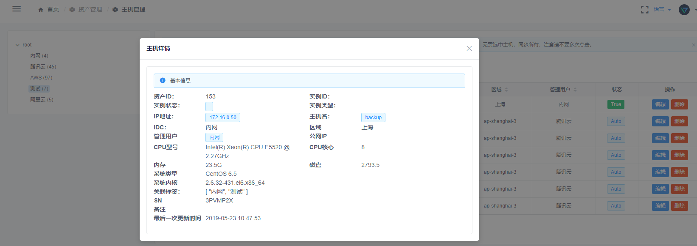
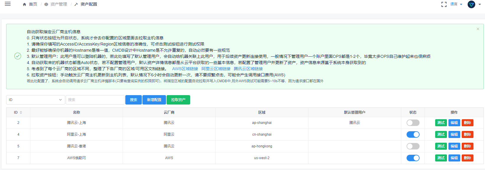

### 资产管理


**前言**
>  简单说明下，Beta0.3版本CMDB进行了重构，后端使用Tornado ，老版Django资产管理代码没有删除，在Tag里面，后续CMDB将持续更新支持跳板审计的功能


**目前功能**  

- 支持主机记录
- 支持数据库记录
- 支持从主机列表系统获取信息（定时、手动）
- 支持从AWS/阿里云/腾讯云自动获取数据(可选、定时)
- 支持主表和详情表分离，可不影响数据的情况下进行扩展
- 众多功能我们一直在开发中，请耐心等待

#### 截图

- 放一些简单示例图片，详细的使用可参考[部署文档](http://docs.opendevops.cn/zh/latest/codo-cmdb.html)、[Demo体验](https://demo.opendevops.cn/login)、[视频示例](https://v.youku.com/v_show/id_XNDE5MzEyNTY5Ng==.html?spm=a2hzp.8244740.0.0) 

  

  



#### 部署文档

> Docker部署方式

**创建数据库**

```
create database `codo_cmdb` default character set utf8mb4 collate utf8mb4_unicode_ci;
```
**修改配置**

- 修改`settings.py`配置信息
  - 注意：需要修改的信息在`settings.py`里面已经标注
  - 请确保你`settings`信息里面`mysql redis`等配置信息的准确性
- `docs/nginx_ops.conf`文件
   - 建议保持默认，毕竟都是内部通信，用什么域名都无所谓，到时候只修改前端访问的域名即可
   - 若你这里修改了，后面DNS、网关都要记得跟着修改为这个域名


**打包镜像**

```
docker build . -t codo_cmdb
```

**启动Docker**

```
docker-compose up -d
```

**初始化表结构**

```
#若是在本地执行需要安装很多SDK包的依赖，建议进入容器执行
#cmdb_codo_cmdb_1:是你的容器名称
docker exec -ti cmdb_codo_cmdb_1 /usr/local/bin/python3 /var/www/codo-cmdb/db_sync.py
```

**日志文件**
- 服务日志：`/var/log/supervisor/cmdb.log`  #主程序日志
- 定时日志：`/var/log/supervisor/cmdb_cron.log` #一些后端守护自动运行的日志

**接口测试**

- 可查看日志看是否有报错
- 默认端口：8050，可直接测试Are you ok?
```
#返回200
 curl -I -X GET -m 10 -o /dev/null -s -w %{http_code} http://cmdb2.opendevops.cn:8050/are_you_ok/
```


### 服务注册

>  由于我们每个模板都是单独部署的，微服务需要在API网关进行注册

**示例**

```
rewrite_conf = {
    [gw_domain_name] = {
        rewrite_urls = {
            {
                uri = "/cmdb2",
                rewrite_upstream = "cmdb2.opendevops.cn:8050"  #nginx配置的域名
            },
            {
                uri = "/mg",
                rewrite_upstream = "mg.opendevops.cn:8010"
            },
            {
                uri = "/accounts",
                rewrite_upstream = "mg.opendevops.cn:8010"
            },
        }
    }
}
```
